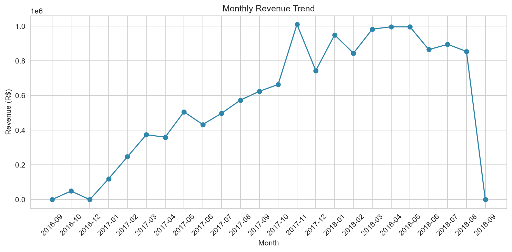
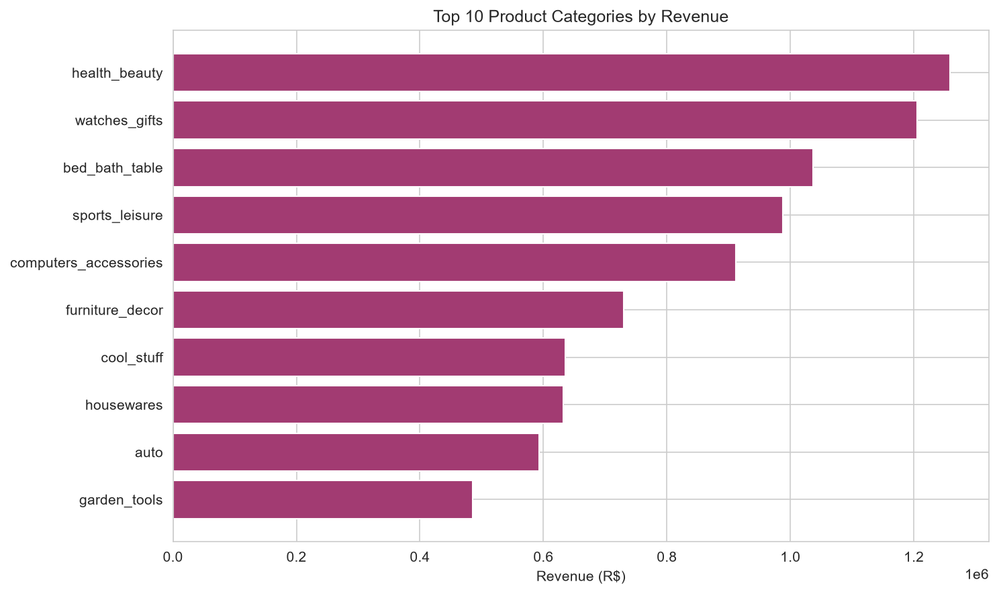
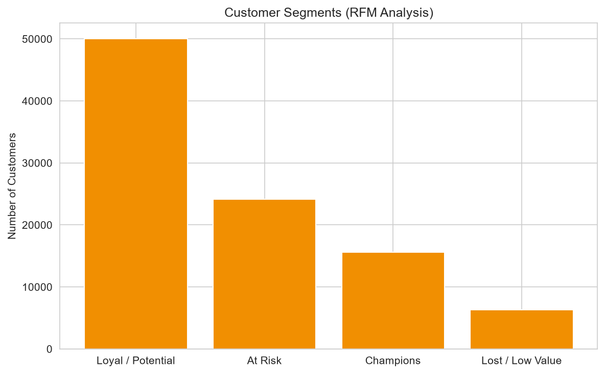
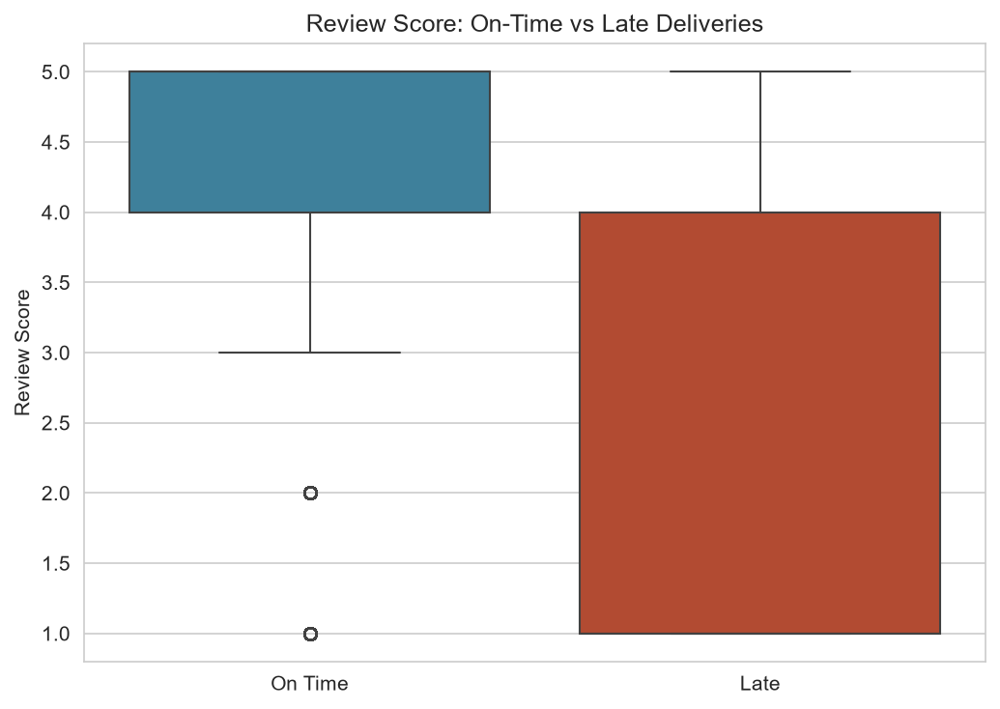

# Olist E-Commerce Data Analysis

End-to-end analysis of ~100K Brazilian e-commerce orders using SQL and Python — covering revenue trends, product performance, customer segmentation, and delivery impact on customer satisfaction.

## Dataset
[Brazilian E-Commerce Public Dataset by Olist](https://www.kaggle.com/datasets/olistbr/brazilian-ecommerce) (Kaggle) — 9 relational tables covering orders, customers, products, payments, and reviews.

## Tools Used
MySQL, Python (pandas, matplotlib, seaborn, SQLAlchemy)

## Process
1. **ETL**: Loaded 9 raw CSVs into a MySQL relational database using Python (`load_data.py`)
2. **SQL Analysis**: Wrote queries covering revenue trends, top product categories, customer ranking (window functions), delivery delay by region, and repeat customer behavior
3. **Python Analysis**: Built an RFM (Recency, Frequency, Monetary) customer segmentation model and analyzed the relationship between delivery delay and review scores (`analysis.py`)
4. **Visualization**: Created supporting charts for each finding (`charts.py`)

## Key Findings

- **Customer segments**: RFM analysis of ~99K customers identified 15,631 "Champion" customers (highest value) and 6,298 "Lost/Low Value" customers, informing where retention efforts would matter most.
- **Delivery impact on reviews**: Orders delivered late averaged a **2.27-star review**, compared to **4.29 stars** for on-time orders — a nearly 2-star gap. Delivery delay and review score showed a moderate negative correlation (r = -0.267).
- **Revenue concentration**: The top 10 product categories account for a disproportionate share of total revenue, led by health & beauty.

## Charts
| Monthly Revenue Trend | Top Product Categories |
|---|---|
|  |  |

| Customer Segments (RFM) | Delivery Delay vs Review Score |
|---|---|
|  |  |

## Files
- `load_data.py` — loads raw CSVs into MySQL
- `analysis.py` — RFM segmentation + delivery/review correlation analysis
- `charts.py` — generates all visualizations
- `rfm_segments.csv` — output of customer segmentation
